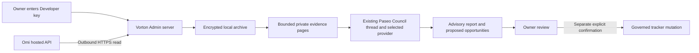

# Omi integration

Vorton retrieves conversations directly from Omi's hosted Developer API. No Omi desktop application, CLI, filesystem replication, public webhook or additional schedule is required. The existing Paseo Council thread reads evidence through the integration adapter. Application code does not invoke a model.

Contract evidence checked September 28, 2026: Omi's [official quick start](https://docs.omi.me/doc/developer/api/overview) documents scoped Developer keys and Bearer authentication. Its [official route implementation](https://github.com/BasedHardware/omi/blob/main/backend/routers/developer.py) applies conversation-read authentication, a 25-record transcript page cap, and post-pagination filtering. These establish documented behavior and source-code expectations, not live account proof. Treat published general rate-limit tables as guidance; actual route-specific limits and Retry-After govern requests.

## Administration

The Omi form now has one Save changes button. A replacement key is validated before the key and preferences commit atomically. Failed validation saves neither. Leave the replacement field empty to keep the current key. Vorton uses read operations even when the owner supplies a broader key.

Open the selected workspace's Admin page, choose Integrations, then Omi. Create an Omi Developer key with only `conversations:read`, enter it in the password field, and validate it. Validation performs a metadata-only read before encrypted storage. Successful validation proves read access, not that broader scopes are absent. Keys are never returned by the API, printed by the CLI, or placed in browser storage. Replacement requires confirmation that retained history belongs to the same account. Omi account identity is not independently verified by this endpoint.

Enable synchronization and Council evidence separately. An empty folder means the whole connected account. Folder filtering applies to future retrieval; previously retained conversations remain available until deleted. It is not a credential scope or a security boundary. Unknown workspaces fail closed.

The integration assumes users record conversations with all parties' consent. It does not maintain a second consent ledger. This assumption does not change local recording laws or establish another person's consent. Recording permission and permission to disclose sensitive information to a model provider remain different questions.

## Custody and recovery

The selected installation stores AES-256-GCM encrypted records in `.runtime/integrations/vault.sqlite`. Authenticated encryption binds each value to its workspace, module and record identity. The default 32-byte master key is `.runtime/secrets/integrations.key`, created with private permissions. `VORTON_INTEGRATION_KEY_FILE` can select a separately provisioned private key file. An existing database with a missing or invalid key fails closed; it is never silently reset.

The installation's OS account can read both files. This protects database copies without the key; it does not isolate hostile code running as the owner or protect a complete host compromise. Use an authenticated private deployment and encrypted host volumes. The application's session token protects requests against cross-site use; it is not a substitute for network access control or owner authentication at the installation boundary.

No backup service is installed by this module. A backup procedure must capture a consistent SQLite snapshot, including pending WAL state, and protect the encryption key separately. Test restoration on an isolated installation. Never copy an open database file alone and assume it is complete. Losing the key loses the archive. Copying the key with the archive defeats separation against backup disclosure.

History retains the latest valid transcript for each source ID, with content hashes, version counters and ingestion timestamps. It does not preserve every prior edit. Removing the Developer key disables ingestion and invalidates its active run but preserves history. Local deletion requires disabled synchronization and a typed confirmation. SQLite secure deletion is enabled; deletion does not guarantee physical erasure from snapshots, storage media, provider retention or backups. Delete those copies through their respective systems. Cloud disappearance never silently deletes the locally retained archive, because a filtered list cannot distinguish deletion from a lock or other temporary exclusion.

The SQLite lookup index contains opaque IDs, keyed day tokens, pending flags and ingestion positions. Exact recording timestamps, titles, participants, content hashes and size metadata remain encrypted. Day tokens use an installation-key HMAC scoped to the workspace and module; database copies reveal grouping and queue state, not calendar dates. Status reads aggregate counters. History decrypts one metadata page and is ordered by ingestion position. Council selects the exact day by token, then inspects at most 100 pending metadata records for up to eight older conversations. A continuation advances only after publication; deferred counts include pending later-day records.

Existing archives require a one-time index migration, at most 250 transcripts per call. The portable command requires an explicit absolute storage root and workspace: `node scripts/omi.mjs index --root /absolute/workspace-storage --profile Example`. Use the same root and profile as the running host. The bundled Last Resort demo uses `.runtime/last-resort` beneath the checkout and profile `LastResort`; pass its absolute path. Repeat until `ready` is true. Private installation wrappers may supply their own admitted roots and profiles. Interrupted migration resumes. Normal operations defer while indexing remains unfinished. SQLite dirty-row triggers detect writes from an older process and force bounded index repair before evidence can be read. Installation rollback retains this additive schema and encrypted records; it does not restore an old database over new history.

## Retrieval and coverage

Requests use the fixed Omi HTTPS endpoint, refuse redirects, and bound time and response size. Each transcript page requests 25 records. Offsets advance by the requested page width, not the returned count. Each committed page is retry-safe. Content changes update a record without duplicating the episode. An interrupted process leaves a ten-minute lease; retries resume committed offsets after expiry. Removing a key cancels outstanding commits.

Council preparation retrieves the previous Pacific day first, then a seven-day overlap and a bounded historical probe. Pacific calendar boundaries account for daylight saving. A daily request budget prevents unbounded work. Day scans continue at their saved offsets when the budget is reached. Productive backfills preserve their original window and continue for as long as necessary, including across multiple weeks. A historical sweep becomes eligible to restart after seven days only once it encounters the empty-page stopping bound. Manual replay and backfill use the same guarded path. Failures retain committed pages and persist exponential retry delays; HTTP 429 honors a longer Retry-After value.

Preparation defers before reserving a Council review attempt if the daily scan fails, exhausts its 20-page budget, excludes returned records, or has not reached its stopping bound. Exclusion counts and consecutive empty-page progress survive resumed batches. An overlap or backfill failure also prevents preparation. Publication rechecks daily readiness and every evidence page. A 04:00 Pacific run for a given Council date reviews the previous completed Pacific day; a midday manual run for that same date uses the same day. An in-progress Pacific day cannot be admitted as a completed daily review. Manual replay can inspect it, but its receipt cannot satisfy the daily gate.

Omi's inspected implementation filters some records after pagination and exposes neither a total nor a stable snapshot cursor. Two empty pages are an operational stopping bound for a day scan, not proof of exhaustion. All receipts explicitly say coverage is unverified. Dense days may need repeated manual replay. Large archives may need weeks of bounded backfill; old edits may take a further sweep to detect. Filtered gaps can still obscure older accessible records. No current implementation can truthfully certify every account record from this list contract alone. Inaccessible, locked, discarded, failed, malformed and not-yet-uploaded conversations remain limitations. Independent source inventory and live acceptance are still required before claiming complete coverage.

## Council evidence and trust boundary

Preparation includes a transcript-free manifest with counts, date window, coverage and digest. The Council reads bounded pages and returns `omiReview` with the current digest and every page index. Publication rejects missing pages or changed evidence. This is an attestation of page review, not proof of model comprehension. Older episodes first received or changed locally during the selected day are included and labeled as late arrivals.

`scripts/omi.mjs council-read --root /absolute/workspace-storage --profile Example --day YYYY-MM-DD --page N --digest DIGEST` intentionally emits raw transcript evidence into the authorized private review thread. Do not redirect it to task logs, reports or strategic registers. Paseo and its selected model provider may retain thread content according to their own settings. Encryption of the local archive does not control those copies. Provider retention and deletion must be verified for the pilot installation.

Portable source includes `server/council-nightly.mjs`, with receipt deduplication, bounded admission, daily scan readiness and all-page publication checks. An installation injects its admitted profiles, storage adapters, policy and Omi workflow. It does not create a scheduler. The private installation's `scripts/council-nightly.mjs` launcher and native adapters are not bundled; the portable demo does not activate unattended Council runs.

Transcript text is untrusted evidence. Spoken requests, quoted prompts and malicious instructions cannot authorize tool use, external actions, account changes or tracker acceptance. Reports must avoid transcript quotations, participant identities, credentials and sensitive third-party details. Health, sexual, legal, financial-account, authentication and children's information require special care and exclusion from general-purpose reports. The page adapter does not claim to reliably identify all such content. The existing model thread must enforce the report boundary; review the first live output before relying on it.

## Acceptance

Unreviewed transcript versions remain queued across day boundaries and failed Council runs. Each packet includes every retained conversation from its selected Pacific day, plus a historical catch-up batch of up to eight whole conversations and approximately 100,000 text characters. A single larger conversation is kept whole and paged. Deferred records remain queued and their count is explicit; a batch receipt never means the entire archive was reviewed. Preparation budgets 20 day pages, two overlap pages and eight historical pages.

Selected days exceeding 10,000 conversations or two million text characters fail explicitly before transcript loading. They are never silently truncated. The current evidence pages are cached encrypted per workspace. Day, index generation, settings, scan receipt and active lease changes invalidate the cache; page requests reject a stale snapshot before decrypting a replacement. Only the current page cache is retained, alongside small encrypted publication snapshots used for exact-version acknowledgement. Five years of synthetic history verifies that routine transcript reads depend on the selected day and bounded historical batch, not archive size. Database size, first migration and full cloud reconciliation still grow with retained history.

A published Council receipt retains the Omi digest and reviewed page indices. Only after that durable receipt exists does the archive acknowledge those exact transcript versions. Edits remain pending. Nightly status reconciles acknowledgement interrupted after publication. Local history deletion clears evidence snapshots. Admin distinguishes connection, retained count, pending Council review and the last confirmed review.

Synthetic tests cover encrypted custody, workspace isolation, key removal during a request, malformed responses, rate limits, partial commits, duplicates, edits, DST, evidence paging and publication guards. The browser check uses a synthetic transport and tests password handling, history rendering, script escaping, and desktop/mobile layouts.

Live acceptance still requires entering a restricted key through Admin, validating its scope in Omi, running a bounded day pull, reviewing retained records and the first Council report, and confirming failure reporting. No test result establishes live account access, source completeness, recording consent, provider retention or deployment acceptance. This module does not activate or alter a schedule and does not create another morning research automation.
